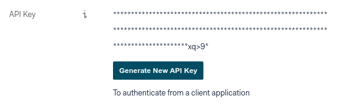
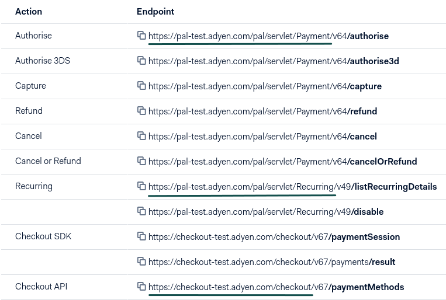

=====
Adyen
=====
`Adyen <https://www.adyen.com/>`__ is a Dutch-based company that allows businesses to
accept **online** and **point-of-sale** payments.

This Payment Acquirer offers additional options that are not available for other :doc:`Payment
Acquirers <../payment_acquirers>`, such as the ability to refund partially a payment directly from
Odoo, to capture the payment after the delivery, or to link a point of sale's terminal.

Payment Acquirer Configuration
==============================

If not done yet, `contact Adyen <https://www.adyen.com/contact/sales>`__ to get your live account.

.. seealso::

   - `Get started with Adyen
     <https://docs.adyen.com/get-started-with-adyen>`__

Credential
----------

Odoo needs your **API Credentials** to connect with your Adyen account, which comprise:

- Merchant Account
- API Key
- HMAC Key
- Checkout API URL
- Payment API URL
- Recurring API URL

To retrieve the API Key, log into your Adyen account, go to :menuselection:`Account --> API
Credentials --> Your username --> Authentication`, and generate your **API Key**.

To retrieve the HMAC Key, TODO

To retrieve the URLs, log into your Adyen account, go to :menuselection:`Account --> API URLs`, and
get your:

- **Checkout API URL** from the Checkout API (`https://checkout_url/checkout/`)
- **Payment API URL** from the Authorize (`https://payment_url/Payment/`)
- **Recurring API URL** from the Recurring (`https://recurring_url/Recurring/`)

.. note::
   Please don't write the end of these endpoints, but let the trailing Forward Slash `/` as shown in
   the exemples.

You can then copy your credentials from your Adyen account, and paste them in the related fields
under the **Credentials** tab.

.. important::
   If you are trying Adyen as a test, with a *test account*, change the **State** to *Test Mode*. We
   recommend doing this on a test Odoo database, rather than on your main database.

Capture the payment after the delivery
--------------------------------------

The **Capture Amount Manually** field is under the **Configuration** tab. If enabled in Odoo and in
Adyen, the funds are reserved on the customer's card, but not charged yet.

.. image:: media/adyen_capture_manually.png
   :align: center
   :alt: Adyen Configuration tab on Odoo

On your Adyen Merchant Account, go to :menuselection:`Account --> Settings`, and set the **Capture
Delay** to **manual**.

.. image:: media/adyen_capture_delay.png
   :align: center
   :alt: Capture Delay settings in Adyen

.. warning::
   If you set the Capture Amount Manually on Odoo but not on Adyen, Odoo won't be able to see it,
   your request for authorization will result in an authorization and immediate capture.

To capture the payment, go to the related Sales Order and click on *Capture Transaction*. If the
order is canceled, you can click on *Void Transaction* to unlock the funds from the customer's card.

.. image:: media/authorize-capture.png
   :align: center
   :alt: Hold the credit card payment until you capture or revoke it on Odoo

.. warning::
   After **7 days**, the authorization can be **revoked** by the customer if it's still not
   captured.

.. note::
   With other payment acquirers, you can manage the capture in their own interfaces, not from Odoo.

.. seealso::
   - `Get started with Adyen
     <https://docs.adyen.com/get-started-with-adyen>`__
   - :doc:`../payment_acquirers`
   - :doc:`../../websites/ecommerce/shopper_experience/payment_acquirer`
