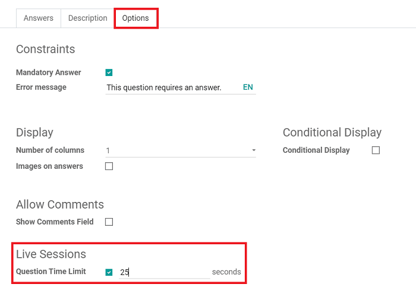
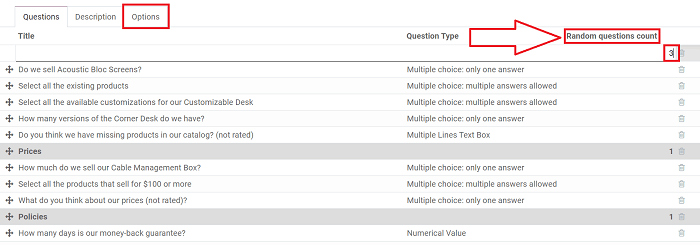
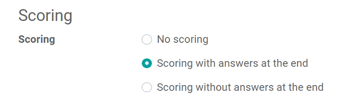
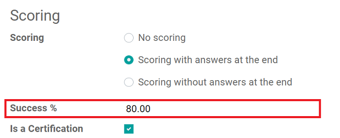
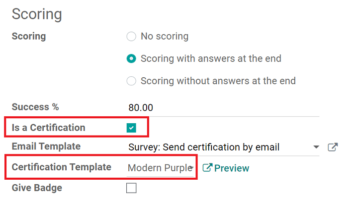
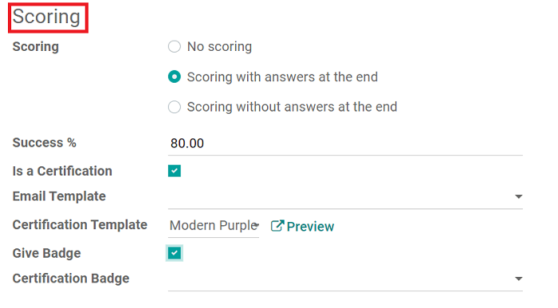
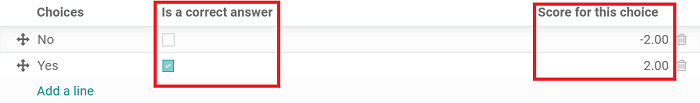

=======
Surveys
=======

**Odoo Surveys** allows you to create unique, compelling, and engaging surveys.

Companies often use surveys to collect valuable information from their customers and/or
employees, which they use to make more informed business decisions.

Surveys can be used for a number of different purposes. They can be used to collect customer
feedback, evaluate the success of a recent event, measure the satisfaction of customers (and
employees), learn what the market is *really* thinking, and so much more.

With easy-to-use question building tools, variety of content options, and simple publishing, you can
start collecting invaluable data, insight, and feedback to help your business grow into the future.

Question types
--------------

After the question has been written in the "Question" field, you choose the "Question Type." A
preview of the question type is shown in this window, as well.

You can choose from the following:

* **Multiple Lines Text Box** - provides the participant with as much room as they'd like to answer

* **Single Line Text Box** - only provides the participant with one line to answer

* **Numerical Value** - only accepts a number as an answer

* **Date** - only accepts a date as an answer

* **Datetime** - requires a specific date and time as an answer

* **Multiple choice: only one answer** - of the multiple options offered, only one of them is
  correct

* **Multiple choice: multiple answers allowed** - of the multiple options offered, more than one
  of them can be correct

* **Matrix** - rows and columns are used to gauge certain things from participants on a scale (i.e.
  *"On a scale from 1-10, how happy are you with your position?"*)

*Answers* and *Options* tab (based on *Question Type*)
------------------------------------------------------

Each "Question Type" reveals different features/options in the *Answers* and *Options* tab that are
specific to that unique "Question Type." However, the *Description* tab will always remain the same.

Here's what the *Answers* tab offers for each individual "Question Type":

* **Multiple Lines Text Box** - Nothing, because they want the participant to answer freely.

* **Single Line Text Box** - *Input must be an email*, *Save as user nickname*, *Validate entry*

* **Numerical Value** - *Validate entry*, *Correct answer* (numerical value), if the question
  should be *Scored*, and if so, you can determine what participants *Score* with a correct response

* **Date** - *Validate entry*, *Correct answer* (date), *Scored*, and *Score*

* **Datetime** - *Validate entry*, *Correct answer* (date and time), *Scored*, and *Score*

* **Multiple choice: only one answer** - *Choices* and the user selects one option as the correct
  answer

* **Multiple choice: multiple answers allowed** - *Choices* but the user can select more than one
  option as the correct answer(s)

* **Matrix** - *Choices* and *Rows*, wherein the *Rows* represent a certain question and the
  *Choices* would represent various answer options to that question

.. note::
   The *Options* tab only looks different for: *Multiple Choice (One or Multiple answers)* and
   *Matrix*. In those instances, the options are purely based on layout and answer options.

Question configuration
----------------------

You can choose to validate an entry, make an answer mandatory, or activate "Conditional Display."

"Conditional Display"
---------------------

*Conditional Display* means a question is only displayed if the specified conditional answer has
been selected in a previous question.

After activating *Conditional Display*, you need to choose a *Triggering Question*. Once done, you
should select the *Triggering Answer* linked to that question.

.. image:: survey/survey_essentials/conditional-triggering-answers.png
   :align: center
   :alt: conditional triggering answer fields

.. note::
   When you are done, remember to hit *Save & Close*, which takes you back to the survey template
   page. You can also hit *Save & New* to instantly start working on another question.

Layout
------

This section primarily focuses on the overall presentation of your survey.

First, you select the layout. You can choose from:

* *One page with all the questions*
* *One page per section*
* *One page per question*

You can also choose how you want to display the participant's progress during the survey. It can
be shown as either a *Percentage* or a *Number* (i.e. 1 of 20 answered).

Below that, you can choose to put a time limit on your survey, modify the question selection to
include all answers or have them randomized by section, and decide if you'd like to present your
participants with a *Back Button*.

Timed questions
===============

With timed surveys, participants must complete the survey within a predetermined amount of time.
You can apply the same time limit feature to individual questions, as well.

Timed surveys and questions ensure that all participants get the same amount of time to answer and
complete the survey. They also discourage participants from looking up answers with external
sources.

Timed surveys
-------------

To set a time limit on a survey, go to the survey template page, go to
:menuselection:`Options Tab --> Select "Survey Time Limit"`, and enter in your desired time limit
(in minutes).

Before participants begin, they will see how much allotted time they have to complete the survey.
During the survey, a timer is shown on the pages so the user can keep track of the remaining time.

.. note::
   Surveys that are not submitted in time **do not** have their answers saved.

Timed questions (in *Live Sessions* only)
-----------------------------------------

Timed questions are only available during Live Session surveys.

To put a time limit on a specific question, simply click the question you wish to modify, and go to
:menuselection:`Options Tab --> Question Time Limit`. At that point, you can specify the time
limit (in seconds).

Randomized questions
====================

When a survey is randomized, the questions will be shuffled in a random order every time a
participant opens the survey. Random surveys are a great way to eliminate the possibility of
participants copying off one another.

Randomized surveys
------------------

To randomize a survey, go to
:menuselection:`Options Tab (of the survey) --> Select "Randomized per section"`.

Once you've enabled that feature, go to the *Questions* tab of the survey, where a
*Random questions count* column is now present.

Here you can decide how many of the questions should be taken into account during the shuffling.

Scoring
=======

Surveys are a great way to measure a person's performance, knowledge of a subject, or overall
satisfaction.

Odoo allows you to attach points to certain answers of survey questions. These points are then
summed up to give your participant a final score.

Scoring configuration
---------------------

Under the *Options* tab on a survey detail form, users have the option to choose between:
*Scoring with answers at the end* **or** *Scoring without answers at the end*.

If you select either *Scoring with answers at the end* or *Scoring without answers at the end*, two
more fields appear. In which, you decide what the "Success %" is, and you can choose to make this a
certification.

You can set the "*Success %*" here, as well. The "*Success %*" is the score the user will need to
achieve in order to have successfully taken the survey.

If "*Is a Certification*" is selected, you can choose its template. The certification is
automatically emailed to users who have successfully finished the survey.

And, if you check the box next to "Give Badge," you are able to select which Certification Badge
you want to give to your participants.

.. note::
   The *Give Badge* feature is **only** available if you enable *Login required* in the
   *Candidates* section of the *Options* tab of the survey detail form.

Then, choose a survey question you want to assign a point value to, and mark which answer is
"correct" on the question pop-up. You can also apply negative point results for "incorrect"
answers, as well.

Candidates
----------

In this section, you can decide who can access this survey.

The "Access Mode" allows you to choose between *Anyone with the link* and *Invited people only*.
You can also decide if you want to grant access to *Appraisal Managers Only*. This person is the
one who manages the various appraisals/surveys.

You can also require participants to log in to access the survey.

You can limit the number of login attempts by ticking *Attempts Limit* and entering a number.

.. image:: survey/survey_essentials/candidates-section.png
   :align: center
   :alt: candidates section of survey settings

Live Session
------------

This section is dedicated to users who are conducting Live Session surveys, wherein they directly
engage with an audience at the same time - much like a live event.

Here, you can choose to reward participants with more points for quick answers. So, if more than
one participant were to choose the correct answer, the quickest (correct) response would be more
valuable, and thus given more points.

You can also customize the specific "Session Code" that participants would need in order to access
the Live Session survey here, as well.

