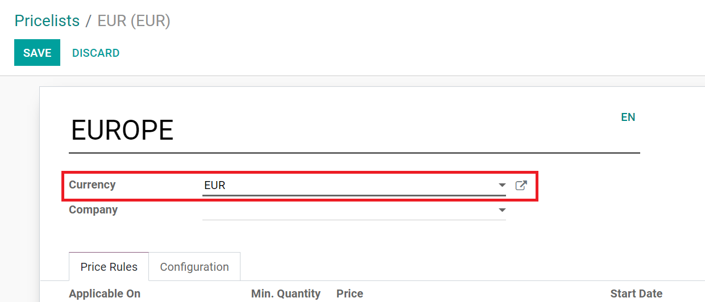
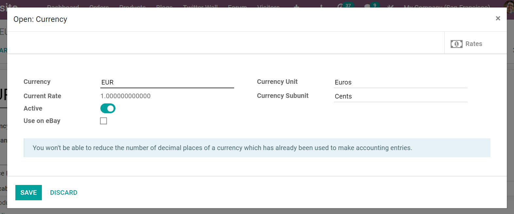
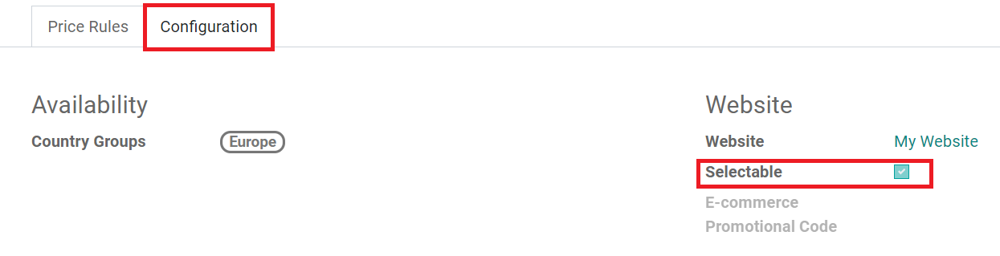
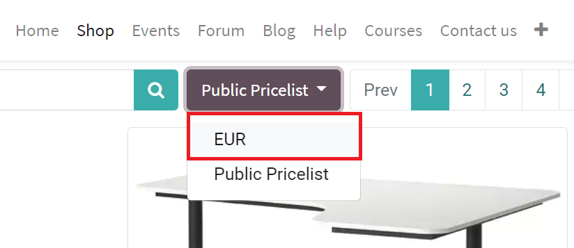

================================
Adapt prices to website visitors
================================

Odoo eCommerce allows users to adapt their prices to their specific website visitors. Users can
force a price by geo-localization or let the customer choose the currency they want to pay with.
This level of flexibility enhances the overall customer experience in numerous ways.

.. seealso::
   As a pre-requisite, check out how to manage product pricing:
   :doc:`../../../sales/sales/products_prices/prices/pricing`).

Geo-IP automatically applies the right price
============================================

You can assign country groups to your pricelists, by going to
:menuselection:`Website --> Products --> Pricelists`. Then, create (or select) a Pricelist to modify
the configuration and currency.

That way, visitors who aren't logged in yet will still get to pay with their own currency when
landing on your website.

Once customers log in, they get the Pricelist that matches their country.

Currency selector
=================

If you work with several currencies, you can let your customers choose
their own. First, check the *Selectable* box (in the *Configuration* tab of the Pricelist detail
form).

This adds the Pricelist to the website drop-down menu, which can be found atop your product
catalog on your website.

.. seealso::

  * :doc:`../../../sales/sales/products_prices/prices/pricing`
  * :doc:`../../../sales/sales/products_prices/prices/currencies`
